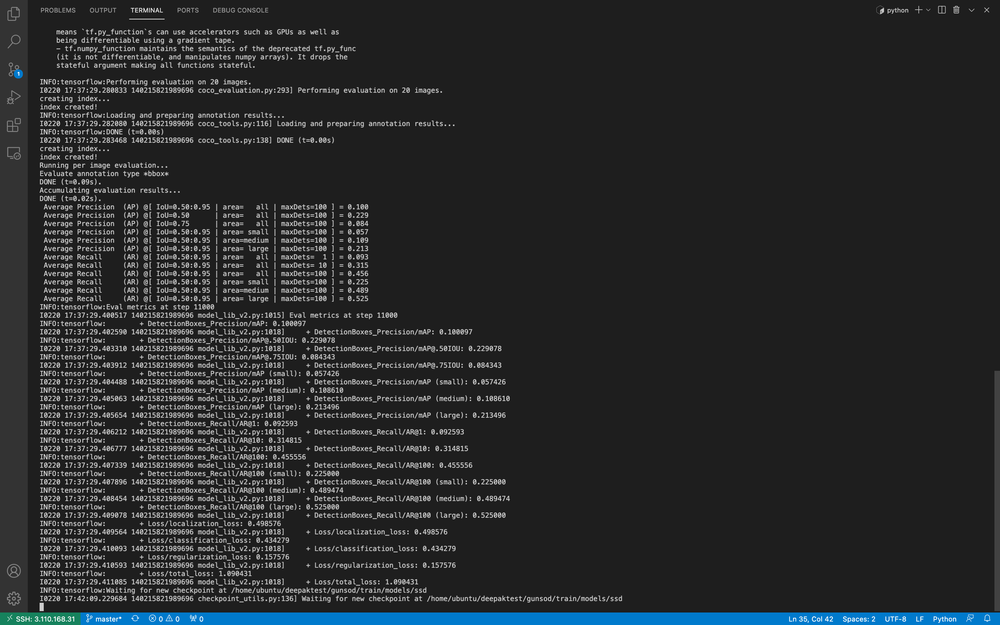

# GUN DETECTOR USING SSD

### Description
 Detecting guns present in the image 
_Input_: Normal image containing Gun.
_Output_: Valid classes: 'Gun'

## Tensorflow Object detection API:
  1. Followed Tensorflow Official object detection API DOC to setup the tensorflow object detection API [TFOD2](https://tensorflow-object-detection-api-tutorial.readthedocs.io/en/latest/)

  2. Followed this to setup the TFOD2 API and custom object detection folder structure.

## Data Preparation   
  1. Converted text annotations into xml annotations then these xml annotations are used to generate tf records.
  2. used <data__prep_notebook data_preprocessing.ipynb> to generate the xml files.

## Training data 

In current dataset contains 330 training images and trained with 320*320 dimensions 

 Train Dataset | Test | 
| --- | --- |
| 312| 20|

Trained the model with batch size 2 and total steps of 5000 steps which means our epochs are roughly 32

## Training instructions: 
    Followed the same instruction mentioned in TFOD2 API doc, link provided above.

### Current performance metrics 

 
Following is the screenshot for model evaluation on 20 test images.

  

## Inference:
Model Inference is written in <Inference_Notebook inference.ipynb>

### Testing instructions 

1.Copy Utils folder in from model/objectdetection/utils or install the TFOD2 API as mentioned above

2.Install dependencies using requirements.txt file

3.Use <Inference_Notebook inference.ipynb> to test the model on different images.